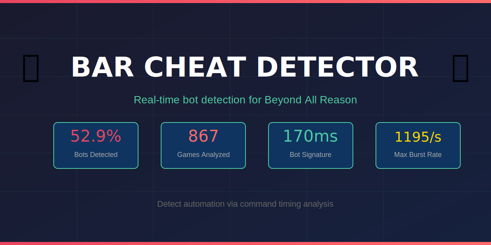
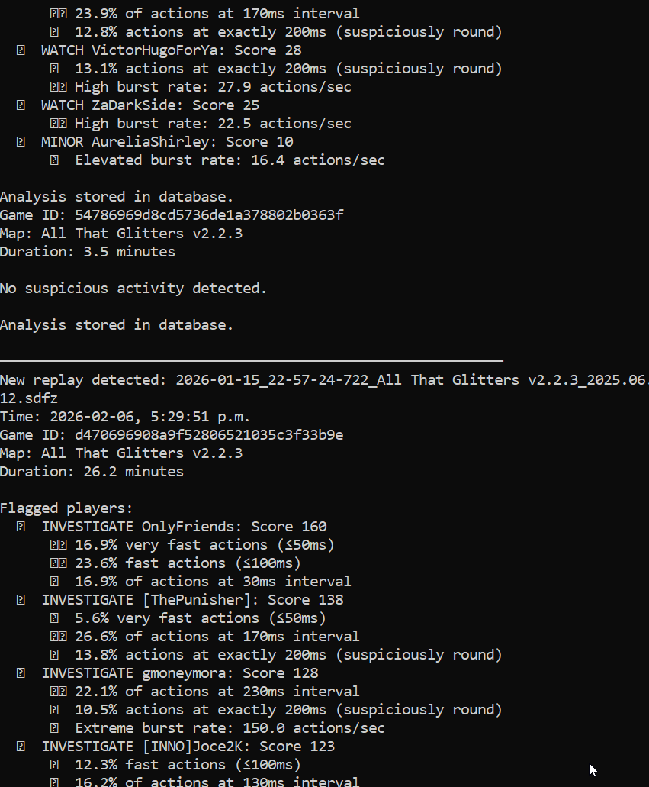
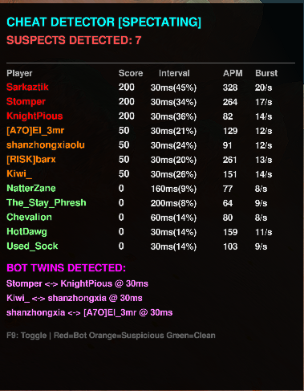

# BAR Cheat Detector







> **Disclaimer:** This is an experimental/novelty project for educational purposes. Detection results are not guaranteed to be accurate and should not be used as definitive proof of cheating. False positives may occur. The authors take no responsibility for any actions taken based on this tool's output. Use at your own discretion.

Real-time and replay-based cheat/bot detection for [Beyond All Reason](https://www.beyondallreason.info/).

Detects automation patterns including:
- **170ms keyboard repeat automation** (5.88 Hz - the smoking gun)
- **Inhuman burst rates** (>30 actions/sec, some bots hit 1000+)
- **Suspicious periodicity** (100ms, 130ms, 200ms intervals)
- **Bot farms** (multiple accounts with identical timing patterns)

---

## Test Results

Analysis of **867 games** (12,684 player-game records):

```
Detection Distribution
═══════════════════════════════════════════════════════════

🚨 BOT (100+)      ██████████████████████████░░░░░░░░░░░░░░░  52.9%  (6,704)
⚠️  SUSPECT (50-99) █░░░░░░░░░░░░░░░░░░░░░░░░░░░░░░░░░░░░░░░░   2.9%    (364)
🔶 WATCH (20-49)   ██████░░░░░░░░░░░░░░░░░░░░░░░░░░░░░░░░░░░  14.5%  (1,842)
✓  CLEAN (0-19)    ████████████░░░░░░░░░░░░░░░░░░░░░░░░░░░░░  29.7%  (3,774)

═══════════════════════════════════════════════════════════
```

**Key findings:**
- Over **50% of player-games** show strong bot indicators
- Detected **10+ bot farms** (3+ coordinated bots in same game)
- Worst offenders: **1,195 actions/sec** burst rate (impossible for humans)
- Common pattern: **170ms interval** (Windows keyboard repeat rate)

---

## Components

### 1. Replay Analyzer (Node.js)
Batch analyze `.sdfz` replay files to build a database of suspicious players.

### 2. Real-Time Widget (Lua)
In-game overlay that monitors player command timing live during matches.

---

## Installation

### Replay Analyzer

```bash
cd bar-analyzer
npm install
```

### In-Game Widget

Copy the widget file to your BAR widgets folder:

```
Windows: %LOCALAPPDATA%\Programs\Beyond-All-Reason\data\LuaUI\Widgets\
Linux:   ~/.spring/LuaUI/Widgets/
```

Use `gui_cheat_detector_spectator.lua` - it works in all modes (spectator AND player).

---

## Usage

### Download Replays

```bash
# Download 50 games for a specific player
node download-player.js PlayerName 50

# Downloads go to ./replays/
```

### Analyze Replays

```bash
# Analyze all replays in ./replays/
node index.js

# Quick single-game analysis (no database)
node quick-analyze.js replays/some_game.sdfz
```

### Generate Reports

```bash
# Top 50 most suspicious players
node report.js suspicious 50

# Detailed report for specific player
node report.js player SomePlayer

# Compare two players
node report.js compare Player1 Player2

# Find bot farms (3+ bots in same game)
node find-farms.js

# Detect hostage games (failed surrender votes)
node detect-hostage.js replays/

# Find bot operators ("farmers") - experimental
node find-farmers.js
```

### In-Game Widget

1. Enable the widget in F11 menu: "Cheat Detector [SPECTATOR]"
2. Press F9 to toggle the overlay
3. Works while spectating OR playing

---

## Detection Methods

### Interval Analysis
Human actions have natural variance. Bots often execute at fixed intervals:
- **170ms** = Windows keyboard repeat rate (5.88 Hz)
- **100ms, 200ms** = Suspiciously round numbers
- **130ms** = Common bot tick rate
- **30-33ms** = Game frame rate (1 action per frame)

### Burst Rate Analysis
Maximum actions in any 1-second window:
- Humans: typically 5-20 actions/sec max
- Bots: often 50-1000+ actions/sec

### Bot Farm Detection
Multiple accounts with identical timing signatures in the same game = same bot operator.

---

## Example Output

```
════════════════════════════════════════════════════════════
QUICK GAME ANALYSIS
════════════════════════════════════════════════════════════

Game: 2026-02-05_Supreme_Isthmus.sdfz
Map: Supreme Isthmus v2.1
Duration: 54.9 minutes

Player                  Score  Top Interval       Status
────────────────────────────────────────────────────────────
toasterbath               113  170ms (15.9%)    🚨 BOT
GrowTall                  113  130ms (15.7%)    🚨 BOT
rickcoder                   3  N/A              ✓  Clean
────────────────────────────────────────────────────────────

Suspicious (score >= 50): 10 / 16
Bot percentage: ~63%

TOP SUSPECT FLAGS:

toasterbath (Score: 113):
  🚨 [CRITICAL] Extreme burst rate: 1195.9 actions/sec
```

---

## Scoring System

| Score | Status | Meaning |
|-------|--------|---------|
| 0-19 | ✓ Clean | Normal human patterns |
| 20-49 | 🔶 Watch | Unusual but not conclusive |
| 50-99 | ⚠️ Suspect | Multiple suspicious indicators |
| 100+ | 🚨 Bot | Strong evidence of automation |

---

## File Structure

```
bar-analyzer/
├── index.js           # Batch replay analyzer
├── analyzer.js        # Core detection engine
├── database.js        # SQLite storage (sql.js)
├── report.js          # Query and reporting tool
├── download-player.js # Bulk replay downloader
├── find-farms.js      # Bot farm detection
├── quick-analyze.js   # Single-game quick analysis
├── replays/           # Drop .sdfz files here
└── widget/
    └── gui_cheat_detector_spectator.lua  # In-game widget
```

---

## API Reference

### BAR Replay API
```
https://api.bar-rts.com/replays?players=NAME&limit=N&hasBots=false
```

### Replay Storage
```
https://storage.uk.cloud.ovh.net/v1/AUTH_.../BAR/demos/FILENAME.sdfz
```

---

## Known Limitations

- **Blueprints**: Build templates may generate rapid commands - testing ongoing
- **Lag spikes**: Network issues can cause command bunching
- **Widget restrictions**: Some multiplayer servers block user widgets

---

## Future Detection Methods

Potential additions for more robust detection:

- **Headless bot detection**: Players with massive unit counts but no lag/performance issues may be using packet injection (not rendering the game, just sending commands). Signals:
  - High unit count with suspiciously low APM
  - Perfect micro on hundreds of units simultaneously
  - No pause/hesitation patterns when overwhelmed

- **Unit control complexity**: Analyze commands-per-unit ratio and micro precision

- **Blueprint filtering**: Distinguish blueprint spam from bot automation

- **Cross-game fingerprinting**: Track timing signatures across multiple games to identify alt accounts

- **Find the Farmer**: ✅ **NOW IMPLEMENTED!** Detect bot operators by correlation:
  - Players who frequently appear in games WITH known bots
  - AND have elevated personal suspicion scores
  - Theory: Operators play on "main" account alongside their bot farm
  - Run with: `node find-farmers.js`

- **Hostage game detection**: ✅ **NOW IMPLEMENTED!** Detects games where losing team is trapped:
  - Parses server vote messages from replay data
  - Tracks failed surrender attempts with timestamps
  - Calculates "hostage score" (failed votes × trapped time)
  - Run with: `node detect-hostage.js replays/`

---

## Verification Program

**Flagged but innocent?** You can prove you're human.

If your name appears in our database and you believe it's a false positive, you can request verification:

1. **Stream a live game** via Twitch, Discord screen share, or similar
2. **Play normally** while being observed by the project author
3. Once verified, you will be:
   - Removed from the suspect database
   - Flagged as **VERIFIED HUMAN**
   - Used as baseline data to improve detection accuracy

This is the **only** way to be verified. No exceptions. Fair play forever.

Contact: Open an issue on this repo to request verification.

---

## Contributing

Pull requests welcome. Key areas:
- Reduce false positives (blueprint detection, etc.)
- Additional detection heuristics
- UI improvements for the widget

---

## License

MIT - See [LICENSE](LICENSE)

---

## Credits

- **rickcoder** - Original concept and testing
- **Claude** - Development assistance
- **BAR Community** - For the amazing game

---

## Disclaimer

This tool is for educational and fair-play purposes. Use responsibly. Report confirmed cheaters through official BAR channels.
